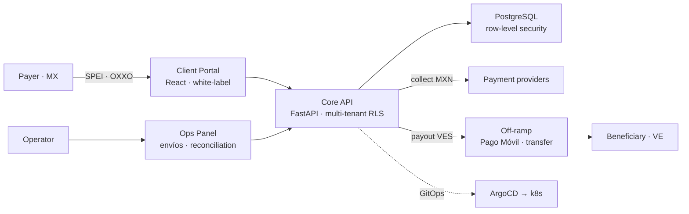
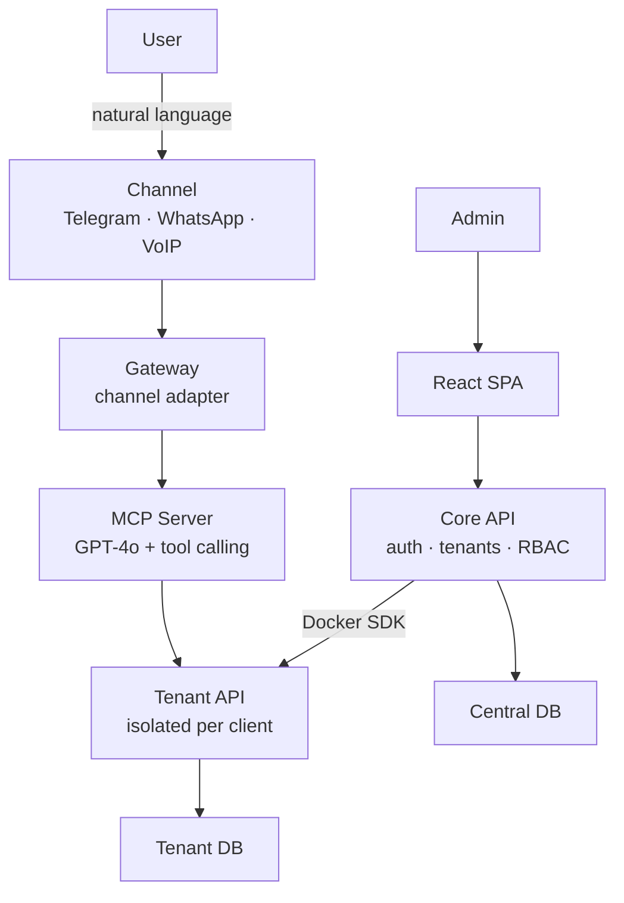

<!-- ═══════════════════════════════════════════════════════════════════════════
                    LUIS ROBERTO GÓMEZ VEIGA · README
        terminal-native profile · built to ship, not to decorate
═══════════════════════════════════════════════════════════════════════════ -->

<div align="center">


<!-- Live "typing" terminal — the closest a GitHub README gets to interactive -->
<a href="https://github.com/lgomez15">

</a>

<br/>

[](mailto:luis@m2g.dev)
[](https://github.com/lgomez15)
[](https://maps.google.com/?q=Panama+City)
[](https://drive.google.com/uc?export=download&id=1CzzagODDGoxA4lorwUVpOsPBORfLpfj2)

</div>

```console
╭─────────────────────────────╮
│  ● ● ●          zsh · 80×24 │   host     Panamá City · remote-first
├─────────────────────────────┤   edu      USAL · CS + Business (dual BSc)
│                             │   role     full-stack engineer · architect
│  $ whoami                   │   stack    FastAPI · React · k8s · Postgres
│  ▸ luis roberto gómez veiga │   shipping M2G — fintech, in production
│  ▸ i build money that       │   theses   voice-AI SaaS · market volatility
│    reconciles.              │   since    2000 · powered by caffeine-507
│                             │   status   ● online — open to hard problems
│  $ ▏                        │
╰─────────────────────────────╯
```

---

## `luis@m2g:~$ whoami`

I build backends that hold up when real money and real users hit them — and I like the part where the architecture gets *simpler* as it scales, not scarier.

Right now I'm shipping **M2G** (below), a fintech platform that's live in production; doing microservices work at **Osprean Technologies**; research-grade full-stack at **BISITE (USAL)**; and closing a **dual degree in Computer Science + Business** with two theses in parallel. I care about clean boundaries, real-time systems, and software that stays boring under load.

<div align="center">

`FastAPI` · `TypeScript` · `React` · `Kubernetes` · `PostgreSQL` · `GitOps` · `Docker` · `WebSockets`

</div>

---

## `luis@m2g:~$ cat m2g/README.md` &nbsp;`# the flagship`

> **M2G — fintech, in production, moving real money.**
> A multi-tenant platform whose first product, **Pago Venezuela**, moves remittances **Mexico → Venezuela**: a payer funds a transfer in MXN (SPEI / OXXO), and the beneficiary receives VES (Pago Móvil / bank transfer) — reconciled end-to-end against payment providers. Not a demo. Real payers, real payouts, real reconciliation, shipped continuously.

<p>


</p>



<table>
<tr><td><b>Domain</b></td><td>Cross-border payments · remittances · reconciliation</td></tr>
<tr><td><b>Backend</b></td><td>FastAPI · SQLAlchemy · multi-tenant with Postgres <b>RLS</b> · Celery</td></tr>
<tr><td><b>Frontend</b></td><td>React 18 · Vite · white-label per merchant</td></tr>
<tr><td><b>Infra</b></td><td>Kubernetes · ArgoCD <b>GitOps</b> · GHCR · tag-driven releases</td></tr>
<tr><td><b>The hard parts</b></td><td>idempotent money flows · provider failover · resilient UX when an upstream runs dry — never charge twice, never lose a payout</td></tr>
</table>

---

## `luis@m2g:~$ ls -la ~/thesis` &nbsp;`# two degrees, two theses`

<table>
<tr>
<td width="50%" valign="top">

### `tfg-cs/`
**Multi-tenant Voice-Assistant SaaS**

Any business gets an **AI booking assistant** — over **Telegram · WhatsApp · phone (VoIP)** — with zero code. Each tenant is fully isolated: own DB, own backend, own assistant. **GPT-4o** parses intent and calls tools to create, move, or cancel reservations in real time; a Core API spins up per-tenant stacks via the Docker SDK.

`FastAPI` · `NestJS` · `K8s` · `WebSockets` · `GPT-4o`

</td>
<td width="50%" valign="top">

### `tfg-ade/`
**Uncertainty Indicators & Market Volatility**

*The Business-degree thesis.* A quantitative study of how economic-policy uncertainty (**EPU / CNEPU**) relates to asset volatility in US & Chinese markets — unified monthly panels **2014–2025** (139 obs), taken end-to-end from ingestion & EDA through correlation, uncertainty-regime, **Granger-causality** and **GARCH(1,1)-t** analysis over equities, gold and Bitcoin.

`Python` · `GARCH` · `pandas` · `statsmodels` · `arch`

</td>
</tr>
</table>

<details>
<summary><b><code>tfg-cs/</code> — expand system architecture</b></summary>
<br/>



| Layer | Tech |
|-------|------|
| **AI / LLM** | OpenAI GPT-4o · dynamic tool calling |
| **Channels** | Telegram · WhatsApp · VoIP |
| **Backend** | FastAPI · SQLAlchemy · JWT + RBAC |
| **Frontend** | React 18 · Vite |
| **Infra** | Docker · Traefik · isolated network per tenant |

</details>

<details>
<summary><b><code>tfg-ade/</code> — expand key findings</b></summary>
<br/>

| Market | Key finding |
|--------|-------------|
| **US EPU → Gold** | strongest link: corr `0.510` — the only asset EPU *Granger-causes* (`F=7.45`, `p=0.007`) |
| **US EPU → S&P 500** | corr `0.453` · top-uncertainty months carry `2.08×` the vol of calm ones · relationship jumps `0.10 → 0.41` after 2020 |
| **US EPU → Bitcoin** | near-zero `-0.050` — crypto decoupled from policy uncertainty |
| **China CNEPU → CSI 300** | **negative** `-0.197` · high-CNEPU regimes show *less* vol (`0.76×`) — the inverse of the US pattern |

*Stack:* Python · Jupyter · pandas · statsmodels · `arch` (GARCH(1,1)-t) · matplotlib · seaborn — monthly panels 2014-01 → 2025-07, results serialized to `resultados.json`.

</details>

---

## `luis@m2g:~$ ./stack --list`

<table>
<tr><td valign="top" width="33%">

**`backend/`**


</td><td valign="top" width="33%">

**`frontend/`**


</td><td valign="top" width="33%">

**`infra/ · data/`**


</td></tr>
</table>

<details>
<summary><b>./stack --all &nbsp;<code># the long tail</code></b></summary>
<br/>


</details>

---

## `luis@m2g:~$ git log --oneline ~/experience`

```console
* 2024 → now   feat(work):   Software Engineer @ Osprean Technologies
|              real-time messaging · microservices · production systems
|
* 2024 → now   feat(m2g):    Founder-engineer @ M2G — fintech in production
|              multi-tenant payments · GitOps on k8s · money that reconciles
|
* 2024 → now   feat(thesis):  TFG (CS) — multi-tenant voice-assistant SaaS
|              full system from scratch: infra · backend · AI integration
|
* 2024 → now   feat(thesis):  TFG (ADE) — uncertainty indices vs. volatility
|              end-to-end quant pipeline · GARCH volatility modelling
|
* 2023 → now   feat(work):   Full-Stack Dev @ BISITE Research Group (USAL)
|              research-grade web apps bridging science and engineering
|
* 2023 → 2025  feat(teach):  Programming Instructor @ Academia Titania
|              PHP · SQL · networking · fundamentals to aspiring devs
|
* 2000        init: Luis Roberto Gómez Veiga
```

---

## `luis@m2g:~$ cat /proc/github/stats`

<div align="center">


</div>

---

## `luis@m2g:~$ ping -c 1 luis`

<div align="center">

```console
PING luis (luis@m2g.dev): reply in 64ms — always up for a good problem.
```

[](mailto:luis@m2g.dev)
[](https://github.com/lgomez15)
[](tel:+34663723999)
[](https://drive.google.com/uc?export=download&id=1CzzagODDGoxA4lorwUVpOsPBORfLpfj2)

*Open to interesting projects, collaborations, and any conversation about systems, architecture, or the art of making things boring at scale.*

</div>

<div align="center">

</div>
