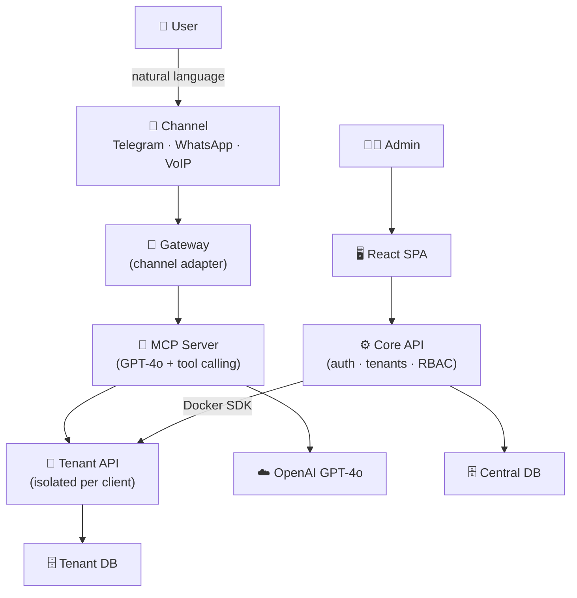

<div align="center">


<br/>

[](mailto:gomez@usal.es)
[](https://github.com/lgomez15)
[](https://goo.gl/maps/salamanca)
[](https://drive.google.com/uc?export=download&id=1CzzagODDGoxA4lorwUVpOsPBORfLpfj2)

<br/>

```

╔═══════════════════════════════════════════════════════════════╗
║  Building scalable systems, real-time architectures, and      ║
║  products that actually ship — from Panama to production.     ║
╚═══════════════════════════════════════════════════════════════╝

```

</div>

---

## `$ whoami`

Hey — I'm Luis Roberto. I'm a **Full-Stack Developer** finishing a **Dual Bachelor's in Computer Science + Business Administration** at the University of Salamanca (May 2026).

I spend my time building microservices at **Osprean Technologies**, doing research-grade full-stack work at **BISITE**, and architecting a multi-tenant SaaS voice assistant platform for my thesis.

I care about clean architecture, real-time systems, and software that doesn't fall apart at scale.

---

## `$ ls -la ./now`

> What I'm actively building right now:

| Status | Project | Stack |
|--------|---------|-------|
| 🟢 **Active** | Multi-tenant SaaS for intelligent voice assistants *(thesis)* | FastAPI · NestJS · K8s · WebSockets |
| 🟢 **Active** | Real-time messaging & microservices @ **Osprean Technologies** | Node.js · Docker · MongoDB · AWS |
| 🟢 **Active** | Full-stack web applications @ **BISITE Research Group** | React · FastAPI · PostgreSQL |

---

## `$ cat thesis/architecture.md`

> **Multi-tenant SaaS — Intelligent Booking Assistant**  
> A platform that lets any business offer an AI-powered booking assistant to their customers — accessible via **Telegram, WhatsApp, or phone call (VoIP)** — without writing a single line of code. Each business (tenant) gets a fully isolated environment: its own database, its own backend, and its own AI assistant configured to its services and schedule. Under the hood, **GPT-4o** understands natural language, resolves intent, and calls the right tools to create, modify, or cancel reservations in real time.



| Layer | Tech |
|-------|------|
| **AI / LLM** | OpenAI GPT-4o · dynamic tool calling |
| **Channels** | Telegram · WhatsApp · VoIP |
| **Backend** | FastAPI · SQLAlchemy · JWT + RBAC |
| **Frontend** | React 18 · Vite |
| **Infra** | Docker · Traefik · isolated network per tenant |

---

## `$ cat tech_stack.json`

<details open>
<summary><b>Frontend</b></summary>
<br/>


</details>

<details open>
<summary><b>Backend</b></summary>
<br/>


</details>

<details open>
<summary><b>Databases & Data</b></summary>
<br/>


</details>

<details open>
<summary><b>DevOps & Cloud</b></summary>
<br/>


</details>

<details>
<summary><b>Other Languages</b></summary>
<br/>


</details>

---

## `$ cat thesis2/uncertainty.md`

> **Uncertainty Indicators & Financial Market Volatility**  
> A quantitative research project analyzing how economic and geopolitical uncertainty indices (EPU, CNEPU) relate to asset volatility across the US and Chinese markets. Built end-to-end: from raw data ingestion and cleaning, through EDA, to GARCH-X predictive modeling — covering daily and monthly horizons across equities, gold, and crypto.

| Market | Key Finding |
|--------|-------------|
| **US EPU → S&P 500** | Correlation with 30d volatility: `0.625` — high-uncertainty regimes drive `1.93x` more vol |
| **US EPU → Gold** | Moderate correlation `0.545`, lag effect peaks at 2 days |
| **US EPU → Bitcoin** | Near-zero relationship `0.025` — crypto decoupled from policy uncertainty |
| **China CNEPU → CSI 300** | Negative correlation `-0.321`; strongest predictive lag at **12 months** |

| Layer | Tech |
|-------|------|
| **Languages** | Python · Jupyter |
| **Modeling** | GARCH-X · time-series regression |
| **Data** | EPU Index · CNEPU · S&P 500 · CSI 300 · Gold · Bitcoin |
| **Pipeline** | pandas · statsmodels · matplotlib · seaborn |

---

## `$ git log --oneline ./experience`

```

2024 → now   feat: Software Engineer @ Osprean Technologies
└─ Real-time messaging, microservices architecture, production systems

2024 → now   feat: TFG — Multi-tenant Voice Assistant SaaS
└─ Designing the full system from scratch: infra, backend, and AI integration

2024 → now   feat: TFG — Uncertainty Indicators & Market Volatility
└─ Quantitative analysis of EPU indices vs asset volatility (GARCH-X modeling)

2023 → now   feat: Full-Stack Developer @ BISITE Research Group (USAL)
└─ Research-grade web applications bridging science and engineering

2023 → 2025   past: Programming Instructor @ Academia Titania
└─ Taught PHP, SQL, networking, and fundamentals to aspiring devs

```

---

## `$ cat ./stats`

<div align="center">

</div>

---

## `$ ping -c 1 luis`

<div align="center">

| | |
|---|---|
| 📧 **Email** | [gomez@usal.es](mailto:gomez@usal.es) |
| 📱 **Phone** | +34 663 723 999 |
| 📄 **CV** | [Download here](https://drive.google.com/uc?export=download&id=1CzzagODDGoxA4lorwUVpOsPBORfLpfj2) |
| 💻 **GitHub** | [@lgomez15](https://github.com/lgomez15) |

*Always open to interesting projects, collaborations, and conversations about systems, architecture, or DevOps.*

</div>

---

<div align="center">


</div>
